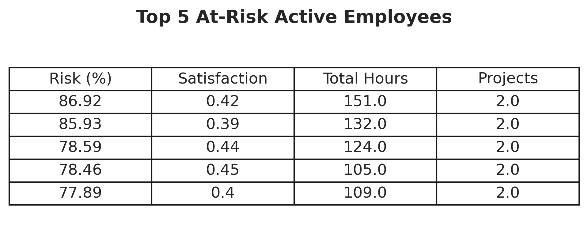

# Predictive HR Attrition & Analytics API

Welcome to the **Predictive HR Attrition** system. This project transitions standard HR data analytics into a robust, production-grade machine learning microservice. It provides not just predictions on whether an employee will leave, but **explainable insights (SHAP)** describing exactly *why* they might leave.

## 🏗 System Architecture & Data Flow

This project follows an industry-standard separation of concerns, moving away from monolithic Jupyter Notebooks into scalable Python modules and REST APIs.

### 1. System Overview Diagram


### 2. ML & Data Pipeline Diagram


---

## 📊 Visualizations & Model Insights

*Note: The model was trained heavily on Google Colab to preserve local resources. The visual outputs of the training process are listed below:*

### Confusion Matrix
*(Shows True/False Positives vs. Negatives)*


### Feature Importance (Global)
*(Which factors impact the whole company the most?)*


### SHAP Plot (Local)
*(Granular look at continuous impact direction on predictions)*


### Top 10 High-Risk Employees
*(Daily calculated ranking of highest attrition probability)*


---

## 📂 Project Structure

```text
HR-Retention-System/
│
├── src/                        # Machine Learning pipeline source code
│   ├── data_preprocessing.py   # Data cleaning functions
│   ├── feature_engineering.py  # Categorical encoding handling
│   └── predict.py              # ML Inference and SHAP explanations
│
├── api/                        # API Deployment
│   └── main.py                 # FastAPI endpoints
│
├── models/                     # Saved Models
│   └── model.pkl               # Generated offline (e.g. Google Colab)
│
├── notebooks/                  # Training scripts
│   └── training.ipynb          # Original Jupyter Notebooks
│
├── requirements.txt            # Environment dependencies
└── README.md                   # You are here
```

---

## 🚀 How to Run the API Locally

**Prerequisites:**
You need Python 3.9+ installed on your machine. Ensure you have the `model.pkl` downloaded from your Colab training and placed inside the `/models` directory.

1. **Install Dependencies**
   ```bash
   pip install -r requirements.txt
   ```

2. **Run the Server**
   ```bash
   uvicorn api.main:app --reload
   ```

3. **Interact with the API**
   - Head over to `http://127.0.0.1:8000/docs` in your browser.
   - You will see the auto-generated Swagger UI where you can test the `POST /predict` endpoint live.

---

## 🔮 Future Enhancements (Production Readiness)
While this current setup perfectly demonstrates a modular deployment and inference pipeline, taking this to a full enterprise-level environment would involve:
- **MLOps (MLFlow)**: Implementing MLflow to track model experiments, hyperparameters, and dataset versions.
- **Containerization (Docker)**: Wrapping the API into a Docker image for standard agnostic deployment across Kubernetes or AWS ECS.
- **CI/CD (GitHub Actions)**: Establishing automated formatting (Black/Ruff) and unit testing (Pytest) on every repository push to maintain code quality.
