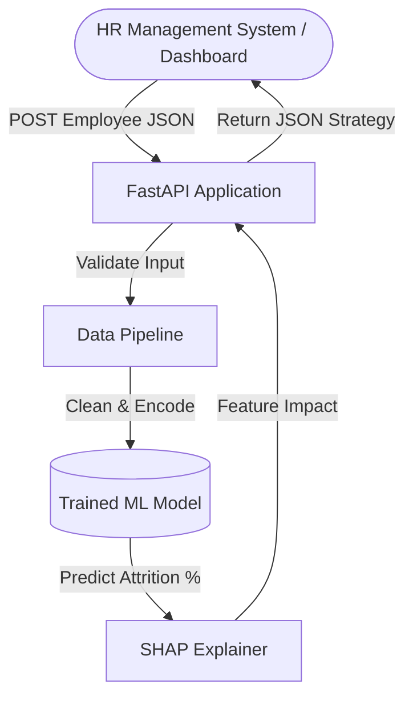
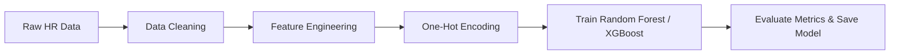
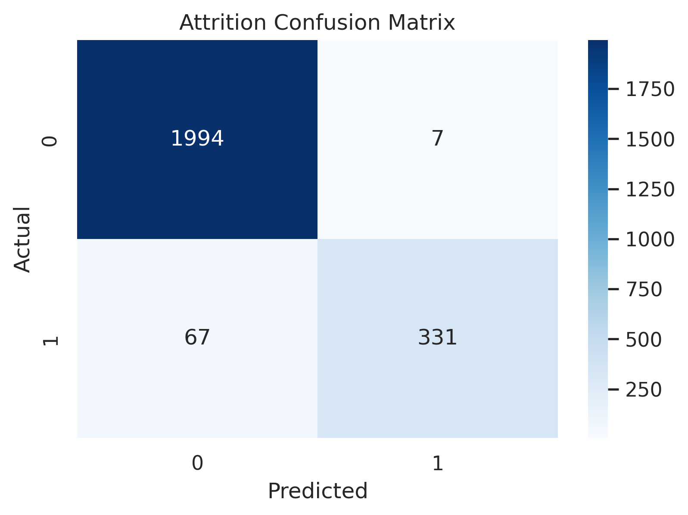
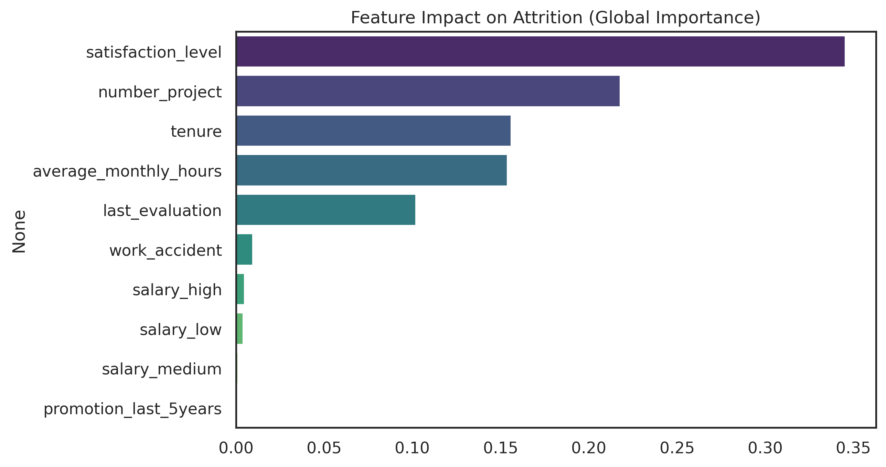
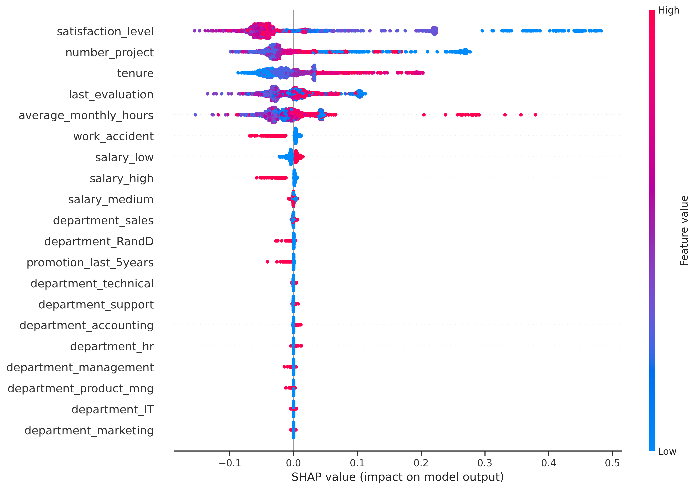

#  Predictive HR Attrition System: An AI-Powered Retention Tool

## The Business Problem & Project Impact
Employee turnover is extremely costly. When experienced employees leave unexpectedly, companies lose institutional knowledge, project momentum, and face high recruitment and training costs. 

**This project solves that problem** by moving from reactive HR practices to **Proactive AI-Driven Retention**. 
Instead of conducting "exit interviews" after the damage is done, this Machine Learning microservice analyzes current employee data to predict *who* is likely to leave and uses **Explainable AI (SHAP)** to tell HR exactly *why* they are leaving (e.g., burnout from too many projects, low salary, or lack of recent promotions). This allows HR to intervene with personalized retention strategies before resignations happen.

---

## System Architecture & Data Flow

This project follows an industry-standard separation of concerns, moving away from monolithic Jupyter Notebooks into scalable Python modules and production-grade REST APIs.

### 1. System Overview Diagram


### 2. ML & Data Pipeline Diagram


---

##  Visualizations & Model Insights

*Visualizations generated during the Exploratory Data Analysis (EDA) and Model Training process in notebooks:*

### Confusion Matrix
*(Shows True/False Positives vs. Negatives)*


### Feature Importance (Global)
*(Which factors impact the whole company the most?)*


### SHAP Plot (Local)
*(Granular look at continuous impact direction on predictions)*


---

##  Complete Project Structure

```text
HR-Retention-System/
│
├── src/                        # ML Pipeline source code (Modularized)
│   ├── data_preprocessing.py   # Data cleaning & validation
│   ├── feature_engineering.py  # Categorical encoding handling
│   └── predict.py              # ML Inference and strict reindexing logic
│
├── api/                        # API Deployment Layer
│   └── main.py                 # FastAPI endpoints & Pydantic models
│
├── models/                     # Serialized AI Assets
│   ├── model.pkl               # Core trained classifier
│   ├── encoder.pkl             # Fitted OneHotEncoder
│   └── feature_columns.pkl     # Strict column ordering for production consistency
│
├── notebooks/                  # Research & Training
│   └── training.ipynb          # Original Jupyter Notebook (EDA & Modeling)
│
├── visuals/                    # Saved plots and charts
│   ├── confusion_matrix.png
│   ├── feature_importance.png
│   └── shap_summary.png
│
├── requirements.txt            # Python environment dependencies
└── README.md                   # Project documentation
```

---

##  Tech Stack
- **Machine Learning**: Scikit-Learn, XGBoost, Pandas, Numpy
- **Explainable AI**: SHAP (SHapley Additive exPlanations)
- **Backend / API**: FastAPI, Uvicorn, Pydantic
- **Environment**: Python Virtual Environments (`venv`)

---

##  How to Run the API Locally

**Prerequisites:** Python 3.9+ installed on your machine.

1. **Activate Virtual Environment** (Windows example):
   ```bash
   python -m venv venv
   venv\Scripts\activate
   ```

2. **Install Dependencies**
   ```bash
   pip install -r requirements.txt
   ```

3. **Run the Server**
   ```bash
   uvicorn api.main:app --reload
   ```

4. **Interact with the API**
   - Head over to `http://127.0.0.1:8000/docs` in your browser.
   - Use the auto-generated Swagger UI to test the `POST /predict` endpoint live.

---

##  Future Enhancements (Production Readiness)
While this current setup perfectly demonstrates a modular deployment and inference pipeline, taking this to a full enterprise-level environment would involve:
- **AI Agentic Layer**: Using GenAI (LLMs) to automatically draft personalized email/strategy interventions based on SHAP factors.
- **Containerization (Docker)**: Wrapping the API into a Docker image for standard agnostic deployment.
- **CI/CD (GitHub Actions)**: Establishing automated code checks on every repository push to maintain code quality.
